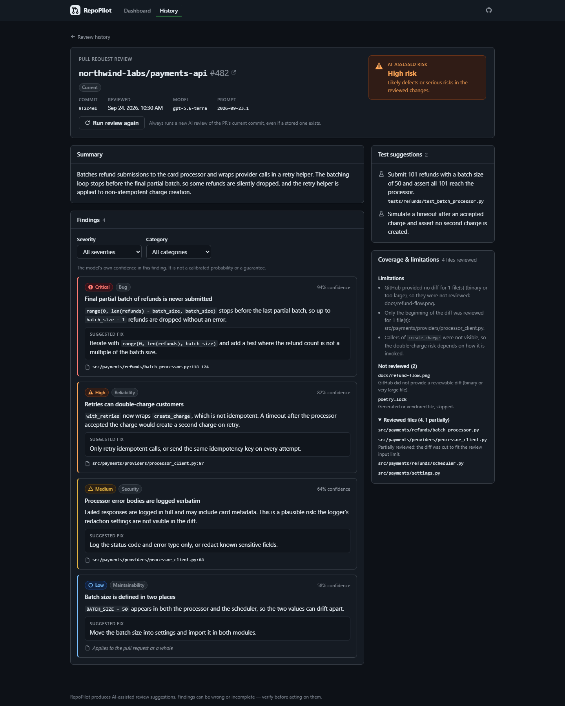
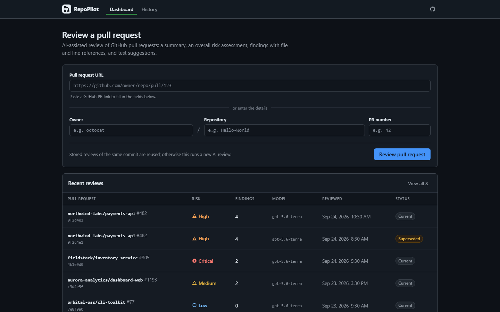
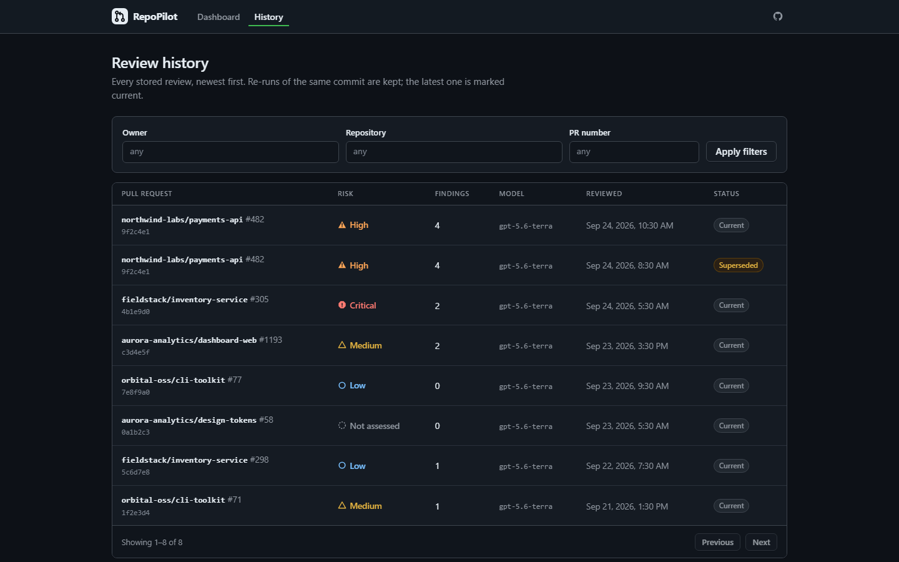
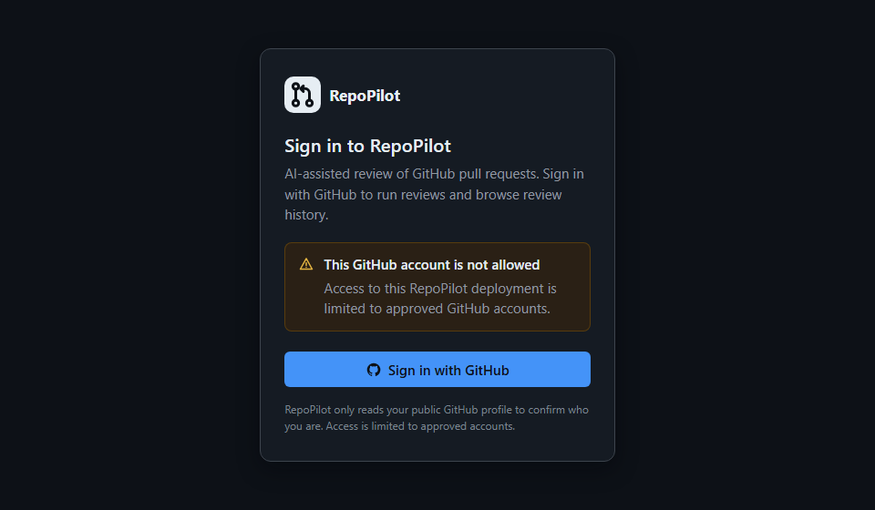
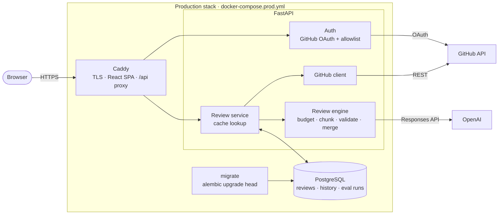

# RepoPilot

**AI-assisted GitHub pull request reviewer.** RepoPilot reads a PR's diff, asks an LLM for a
structured review, checks the result against the diff it actually sent, and stores every
review so unchanged PRs are never paid for twice.

[](https://github.com/gladwynL/repopilot/actions/workflows/ci.yml)


[](LICENSE)



> **Status:** complete and production-ready (Docker, CI, GitHub sign-in), but **no public
> instance is hosted**. The review pipeline is fully tested with mocked GitHub and OpenAI
> responses; it has **not yet been run against the live OpenAI API**. Screenshots show seeded
> demo data.

## What it does

Paste a GitHub PR link and RepoPilot returns:

- a short summary and an overall **AI-assessed risk** (low → critical)
- **findings** with category, severity, the model's confidence, a suggested fix, and a
  `file:line` reference, kept only when it points into the reviewed diff
- **test suggestions** for meaningful behavior changes
- **coverage and limitations**: which files were skipped or cut short, and why

Every review is stored. Asking again about the same commit returns the stored review without
calling the model. You can force a re-run, and older runs stay in the history.

| Dashboard | Review history | Sign-in gate |
| --- | --- | --- |
|  |  |  |

## Features

- **GitHub PR ingestion.** A read-only REST client fetches metadata and every changed file
  (with pagination) into a typed, normalized model.
- **Structured AI review.** Uses the OpenAI Responses API with a strict JSON schema; every
  response is validated with Pydantic before use.
- **Diff-aware grounding.** File and line references are checked against the supplied diff,
  and unsupported ones are dropped rather than guessed.
- **Large-PR handling.** Deterministic file ranking, a token budget, per-file truncation,
  chunking, and a merge with deduplication done in code.
- **Review cache and history.** Keyed by commit SHA, model, prompt version, and budget
  settings, stored in PostgreSQL, with forced re-runs kept as history.
- **Evaluation framework.** A fixed case suite, per-condition metrics, stored runs, and a CLI.
- **Dashboard.** React + TypeScript, responsive, light and dark themes, honest loading and
  empty states.
- **Access control.** Sign in with GitHub (OAuth with state + PKCE), an allowlist, and signed
  session cookies.
- **Production delivery.** Non-root Docker images, Caddy with automatic HTTPS, one-shot
  migrations, and GitHub Actions CI.

## How it works

1. The user submits a PR (URL or owner/repo/number) from the dashboard.
2. The API fetches the PR's metadata and per-file diffs from GitHub and normalizes them.
3. It computes a **cache key** from the commit SHA and the review configuration. If a stored
   review matches, that review is returned and the model is never called.
4. Otherwise the input builder skips unusable files, ranks the rest deterministically, cuts
   oversized diffs, and packs everything into token-budgeted chunks.
5. Each chunk goes to the LLM with fixed review instructions. The model must answer in a
   strict JSON schema.
6. RepoPilot validates each answer, drops references the diff can't support, and merges and
   deduplicates across chunks.
7. The review is saved to PostgreSQL and shown in the dashboard. Its history, re-runs, and
   coverage details stay available.

## Architecture



The frontend and API share one HTTPS origin, so production needs no CORS setup and the
session cookie stays first-party. Only Caddy is exposed. The API trusts forwarded headers
only from Caddy's network, and the database sits on an internal network with no internet
access. More detail: [review engine](docs/review-engine.md), [API](docs/api.md),
[deployment](docs/deployment.md).

## Engineering highlights

**Structured, validated AI output.** The provider uses OpenAI's Responses API with a strict
schema generated from Pydantic models and `store: false`. Anything unexpected (invalid JSON,
schema violations, refusals, truncated output) becomes a typed error with a safe message.
Transient failures are retried with backoff. Timeouts and credential errors are not retried.

**Hallucination controls.** Each diff line is shown to the model with its new-file line
number. After the response, findings that cite unreviewed files lose their file reference,
and line numbers outside the supplied diff become `null`. The instructions tell the model to
prefer zero findings to invented ones and to lower confidence when context is missing. Missing
GitHub patches are reported as limitations, never silently ignored.

**Bounded, deterministic large-PR handling.** Generated files and files with no diff are
skipped. The rest are ranked (source, then sensitive config, then tests, then other), cut at
line boundaries, and packed first-fit into token-budgeted chunks. Chunk results are merged in
code (highest risk wins; findings deduplicated by file, line, category, and title), so there
is no extra LLM call and the same input always produces the same prompts.

**Cache-aware persistence.** The cache key is a SHA-256 over the owner, repository, PR number,
`head_sha`, model, prompt version, and budget settings, so a stored review is reused only when
the code and review configuration are identical. PostgreSQL enforces a single "current" review
per key with a partial unique index, and concurrent saves are serialized with an advisory lock.
Forced re-runs keep earlier reviews as history.

**Security.** GitHub OAuth uses a single-use `state` and PKCE S256 and requests no scopes. The
OAuth token is discarded after one profile read. The session is a signed `HttpOnly`/`Secure`/
`SameSite=Lax` cookie. A case-insensitive allowlist is re-checked on every request. Production
settings are validated at startup, and errors name the setting but never its value. Secrets
stay server-side. Caddy sets CSP and HSTS and strips OAuth parameters from its access logs.

**Delivery.** Multi-stage, non-root images. Migrations run as a one-shot service that must
succeed before the API starts. Readiness gates the proxy. CI runs backend, PostgreSQL
integration and migration, frontend, image-content, production-stack smoke, and
secret-hygiene checks.

## Tech stack

| Area | Tools |
| --- | --- |
| Backend | Python 3.12, FastAPI, Pydantic, SQLAlchemy 2, Alembic, HTTPX |
| AI | OpenAI Responses API with structured outputs (provider behind an interface) |
| Data | PostgreSQL 16 |
| Frontend | React 19, TypeScript, Vite, React Router, CSS Modules |
| Testing | pytest, Vitest, Testing Library |
| Delivery | Docker, Caddy, Docker Compose, GitHub Actions |

## Testing and CI

- **Backend:** 250 tests run with no database or network. GitHub and OpenAI are mocked at the
  HTTP layer, so the real SDKs and error handling are exercised without paid calls.
- **PostgreSQL integration:** 18 more tests run against a real PostgreSQL 16 database. They
  cover migrations (upgrade, downgrade, drift check), repositories, concurrent saves, and the
  API end to end.
- **Frontend:** 92 component and interaction tests with the API layer mocked.
- **Production stack:** CI builds both images, checks their contents, and runs a smoke test of
  `docker-compose.prod.yml` in production mode.

Every push and pull request to `main` runs the [CI workflow](.github/workflows/ci.yml): hygiene,
backend, PostgreSQL integration, frontend, and production images.

```bash
cd backend && pytest && ruff check . && ruff format --check .
cd frontend && npm run test && npm run lint && npm run build
```

## Quick start

Prerequisites: Python 3.12, Node.js 22+ (CI uses 24), Docker.

```bash
git clone https://github.com/gladwynL/repopilot.git && cd repopilot
cp .env.example .env                 # add OPENAI_API_KEY to run new reviews
docker compose up -d db              # PostgreSQL

cd backend
python -m venv .venv && source .venv/bin/activate   # Windows: .venv\Scripts\activate
pip install -r requirements-dev.txt
alembic upgrade head
uvicorn app.main:app --reload        # http://localhost:8000

cd ../frontend                       # in a second terminal
npm install && npm run dev           # http://localhost:5173
```

Sign-in is off locally (`AUTH_ENABLED=false`). Without an OpenAI key, everything except new AI
reviews works: stored reviews, history, and PR ingestion. Every setting is documented in
[.env.example](.env.example).

**Production-like stack** (Caddy + API + PostgreSQL + migrations):

```bash
cp .env.example .env.production      # set POSTGRES_PASSWORD, HTTP_PORT=8080, HTTPS_PORT=8443
docker compose -f docker-compose.prod.yml --env-file .env.production up -d --build --wait
```

See [docs/deployment.md](docs/deployment.md) for the deployment guide, hosting comparison,
migrations and rollback, backups, and the security model.

## Project structure

```
backend/
  app/
    api/            routes (thin), dependencies, error mapping
    services/       GitHub client, review service, auth, ai/ (engine), evaluation/
    repositories/   all SQL
    models/         SQLAlchemy models
    schemas/        Pydantic API contract
  alembic/          migrations
  tests/            unit tests; tests/postgres/ runs against a real database
frontend/src/
  api/              typed client and error mapping
  features/         reviews/, auth/
  components/       design-system primitives and app shell
  pages/            route screens
docs/               API, review engine, deployment, roadmap, portfolio notes
scripts/ci/         hygiene, image, and production-stack smoke checks
docker-compose.yml, docker-compose.prod.yml, .github/workflows/ci.yml
```

## Limitations

- **AI findings can be wrong or incomplete.** RepoPilot assists code review; it doesn't replace
  it.
- Only the supplied diffs are reviewed. Full files and the rest of the repository are not
  fetched.
- GitHub omits patches for binary and very large files. Those files are listed as not
  reviewed.
- Confidence is reported by the model, not a calibrated probability.
- Large PRs are reviewed in chunks, so an issue spanning chunks can be missed. The review says
  so when this happens.
- Not yet validated live: no public deployment, and no run against the real OpenAI API.

## Future work

Not implemented; possible next steps:

- a GitHub App with webhooks to review PRs automatically and post inline comments
- repository-wide context (full files, call sites) for deeper reviews
- background review jobs with real progress updates
- a larger, labeled evaluation set for measuring model quality
- more LLM providers behind the existing provider interface
- a hosted public demo

## License

[MIT](LICENSE) © 2026 Gladwyn Lau
