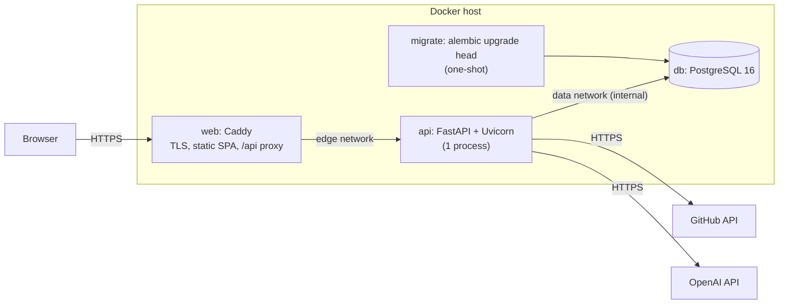

# Deploying RepoPilot

Status: **deployment-ready, not deployed.** Everything below is built and tested, locally and in CI
(production images, production Compose stack, migrations, health checks, the sign-in gate), but
no public instance exists yet. It needs a server or hosting account, a domain, a GitHub OAuth
App, and an OpenAI API key.

## Architecture



- **One public origin.** Caddy serves the React build and forwards `/api/*`, `/health`, and
  `/ready` to FastAPI. The browser only talks to that origin, so there is no production CORS
  setup and session cookies stay first-party. `VITE_API_BASE_URL` stays empty.
- **Only Caddy publishes ports** (80/443). The API and database have no host ports. The
  database sits on an `internal` network with no route to the internet.
- **Proxy trust is explicit.** The API honours `X-Forwarded-*` only from `EDGE_SUBNET`, the
  private network Caddy uses (`FORWARDED_ALLOW_IPS`).

| Image | Built from | Notes |
| --- | --- | --- |
| `repopilot-api` | `backend/Dockerfile` | Python 3.12 slim, multi-stage, runtime deps only, non-root (uid 10001), `/health` healthcheck |
| `repopilot-web` | `frontend/Dockerfile` | Node 24 build stage → Caddy 2.11; Caddyfile validated at build time |

**Why one Uvicorn process per container:** the AI-review concurrency limit
(`REVIEW_MAX_CONCURRENT`) is a per-process semaphore, and the API is I/O-bound (it mostly waits
on GitHub and OpenAI). Scale out by running more API containers behind Caddy; each has its own
limit, so the total is `containers × REVIEW_MAX_CONCURRENT`.

## Choosing where to run it

Prices change often; the figures below were checked in September 2026. Verify them before
committing.

| Option | Fit | Caveats |
| --- | --- | --- |
| **Small VPS + `docker-compose.prod.yml`** (recommended) | Runs the exact stack tested in CI. Caddy handles TLS. No vendor lock-in. Roughly $4–6/month for a 1–2 GB VM. | You patch the OS and own backups (`pg_dump`, below). |
| Render | Docker services, managed PostgreSQL with backups, Blueprints, long request timeouts. | Free web services sleep after ~15 min idle (30–50 s cold starts). Same-origin needs Caddy plus a private API service (paid). Pre-deploy commands need a paid plan. |
| Railway | One-click PostgreSQL, Docker deploys, private networking. | Usage-based billing on top of the $5 Hobby plan; no ongoing free tier. |
| Fly.io | Docker-native, private networking, `release_command` for migrations. | Per-second VM billing; PostgreSQL options need care; more moving parts. |

**Choice:** a single small VPS running `docker-compose.prod.yml`. It keeps costs predictable,
matches the configuration CI already smoke-tests, avoids splitting the same-origin design
across paid services, and ports to any Docker host.

Sources: [Render: Railway vs Fly.io](https://render.com/articles/railway-vs-fly-io),
[Northflank: Railway vs Render](https://northflank.com/blog/railway-vs-render),
[hostim.dev pricing comparison](https://hostim.dev/blog/render-vs-railway-vs-fly-pricing/).

## Deploying to a VPS

1. **Server.** Any Linux VM with Docker Engine and the Compose plugin. Open ports 80 and 443
   (TCP; UDP 443 for HTTP/3). Keep SSH restricted and the OS patched.
2. **DNS.** Point an `A`/`AAAA` record (e.g. `repopilot.example.com`) at the server.
3. **GitHub OAuth App** (GitHub → Settings → Developer settings → OAuth Apps):
   - Homepage URL: `https://repopilot.example.com`
   - Authorization callback URL: `https://repopilot.example.com/api/auth/callback`
   - Copy the client ID and generate a client secret.
4. **Configuration** on the server:
   ```bash
   git clone https://github.com/gladwynL/repopilot.git && cd repopilot
   cp .env.example .env.production && chmod 600 .env.production
   ```
   Set at least: `ENVIRONMENT=production`, `SITE_ADDRESS=repopilot.example.com`,
   `PUBLIC_APP_URL=https://repopilot.example.com`, `CORS_ORIGINS=` (empty),
   `POSTGRES_USER`, `POSTGRES_PASSWORD` (`openssl rand -hex 24`), `AUTH_ENABLED=true`,
   `GITHUB_OAUTH_CLIENT_ID`, `GITHUB_OAUTH_CLIENT_SECRET`, `AUTH_ALLOWED_GITHUB_USERS`,
   `SESSION_SECRET` (`openssl rand -base64 48`), `OPENAI_API_KEY`, and optionally
   `GITHUB_TOKEN`. The API refuses to start if a required value is missing or unsafe, and the
   error names the setting, never its value.
5. **Start:**
   ```bash
   docker compose -f docker-compose.prod.yml --env-file .env.production up -d --build --wait
   ```
   Order: `db` healthy → `migrate` runs `alembic upgrade head` and must exit 0 → `api` starts and
   must report ready → `web` starts and obtains a certificate. If migrations fail, the API
   never starts and `up --wait` fails.
6. **Verify:** `https://repopilot.example.com/health` and `/ready` return 200. The app shows
   the sign-in screen, sign-in works for an allowlisted account, and other accounts are
   rejected.

### Updating

```bash
git pull
docker compose -f docker-compose.prod.yml --env-file .env.production up -d --build --wait
```

`migrate` runs again before the new API container starts. Running migrations is always a
separate, deliberate step: API processes never migrate on startup, so replicas can't race.

### Migrations and rollback

- Migrations only move forward automatically. Nothing ever runs `alembic downgrade` in
  production.
- **Rolling back code** means deploying the previous commit or image. This only works if the
  database schema is still compatible with it, so write migrations to be backwards compatible
  (add before you remove).
- **Rolling back the schema** is manual: take a backup, then run
  `docker compose -f docker-compose.prod.yml --env-file .env.production run --rm migrate alembic downgrade <revision>`.
  Downgrades can drop data (downgrading revision `0001` drops every review table).

### Backups

The VPS option has no managed backups. Run a nightly dump and copy it off the host:

```bash
docker compose -f docker-compose.prod.yml --env-file .env.production exec -T db \
  pg_dump -U "$POSTGRES_USER" -d repopilot --format=custom > "repopilot-$(date +%F).dump"
```

Managed PostgreSQL (Render, Railway, etc.): point `DATABASE_URL` at it with
`?sslmode=require`, skip the `db` service, and use the provider's backups.

## Security model

- **Authentication:** Sign in with GitHub (OAuth web flow with `state` and PKCE S256, no
  scopes). The access token is used once to read the public profile and then discarded. It
  is never stored and never used for PR ingestion (that's `GITHUB_TOKEN`).
- **Authorization:** a case-insensitive allowlist (`AUTH_ALLOWED_GITHUB_USERS`), checked at
  sign-in and on every request. Removing a login takes effect immediately.
- **Protected:** every `/api/github/*` and `/api/reviews*` endpoint. **Public:** `/health`,
  `/ready`, and `/api/auth/*`. `/docs`, `/redoc`, and `/openapi.json` are disabled in
  production.
- **Sessions:** Starlette signed cookie `repopilot_session`: `HttpOnly`, `Secure` (when
  `PUBLIC_APP_URL` is HTTPS), `SameSite=Lax`, `Path=/`, 8-hour lifetime. The cookie is signed,
  not encrypted: it holds only the public login, name, and avatar URL (plus the short-lived
  OAuth state and PKCE verifier during sign-in). It can't be revoked individually on the
  server. Remove the login from the allowlist, or rotate `SESSION_SECRET` to sign everyone out.
- **CSRF:** state-changing requests are JSON `POST`s, and `SameSite=Lax` keeps the cookie off
  cross-site `POST`s. Production has no CORS origins.
- **Abuse limits:** authentication is the main protection. On top of that, at most
  `REVIEW_MAX_CONCURRENT` AI reviews run at once per API process, and extra cache misses get
  `429` with `Retry-After`. Request bodies over 1 MB are rejected at the proxy.
- **Headers:** CSP (`default-src 'self'`, GitHub avatars allowed), HSTS, `nosniff`,
  `X-Frame-Options: DENY`, `Referrer-Policy`, and `Permissions-Policy`.
- **Logs:** Caddy writes access logs with the OAuth `code` and `state` removed. Cookie,
  Set-Cookie, and Authorization headers are redacted. Uvicorn's access log is off. Application
  logs contain metadata only: no keys, tokens, prompts, or diffs.

## Timeouts

A new review can take minutes: several model calls, each with `OPENAI_TIMEOUT_SECONDS` (90 s)
and up to two retries for transient errors. Caddy allows up to **5 minutes** for the API's
response headers. Anything in front of Caddy (a load balancer or CDN) must allow at least as
long. Cached reviews, history, and sign-in respond in milliseconds.

## Health checks

| Endpoint | Meaning | Used by |
| --- | --- | --- |
| `GET /health` | Process is alive; touches nothing external | Docker `HEALTHCHECK` in the API image |
| `GET /ready` | Database reachable (`SELECT 1`) | Compose `api` healthcheck, which gates `web` |

Neither endpoint calls GitHub or OpenAI, and neither costs money.

## Running the production stack locally

```bash
cp .env.example .env.production   # set POSTGRES_PASSWORD, HTTP_PORT=8080, HTTPS_PORT=8443
docker compose -f docker-compose.prod.yml --env-file .env.production up -d --build --wait
curl -k https://localhost:8443/health
docker compose -f docker-compose.prod.yml --env-file .env.production down -v
```

`SITE_ADDRESS=localhost` makes Caddy use its local CA; browsers warn about the certificate.
With `ENVIRONMENT=development` and `AUTH_ENABLED=false` the app works without sign-in.
`bash scripts/ci/smoke-compose.sh <api-image> <web-image>` runs the same production-mode check
CI uses, with placeholder credentials.

## Behind a platform load balancer

If a platform terminates TLS in front of Caddy (Render, Fly.io, a cloud load balancer), set
`SITE_ADDRESS=:80` so Caddy serves plain HTTP inside the platform. Add a `trusted_proxies`
server option for the platform's proxy range to the Caddyfile, and keep the 5-minute upstream
timeout in mind for the platform's own limits.
