# How the review engine works

Code: `backend/app/services/ai/` (engine, input builder, prompts, provider) and
`backend/app/services/evaluation/` (evaluation suite).

```mermaid
flowchart LR
  pr[Normalized PullRequest] --> skip[Skip files with no diff<br/>and generated files]
  skip --> rank[Rank files deterministically]
  rank --> trunc[Cut oversized diffs<br/>at a line boundary]
  trunc --> pack[Pack into budgeted chunks]
  pack --> llm[LLM per chunk<br/>strict JSON schema]
  llm --> validate[Pydantic validation]
  validate --> ground[Check file and line references<br/>against the supplied diff]
  ground --> merge[Merge and deduplicate]
  merge --> result[ReviewResult]
```



## Input budgeting

RepoPilot enforces its own input budget instead of relying on the model's context window.

1. **Skip** files GitHub sent no diff for (binary or very large) and generated or vendored
   files (lockfiles, minified bundles, `vendor/`, `dist/`, ...). Each is listed with the reason.
2. **Rank** the rest: source code, then security-sensitive config (CI, Docker, dependency
   manifests), then tests, then other files, then deletions. Within a tier, larger changes come
   first; ties break on path. There is no randomness, so the same PR always produces the same
   input.
3. **Truncate** any single diff over `REVIEW_MAX_FILE_TOKENS` at a line boundary and mark the
   file as partially reviewed.
4. **Pack** files first-fit into at most `REVIEW_MAX_CHUNKS` requests of
   `REVIEW_CHUNK_TOKEN_BUDGET` estimated tokens each. Files that fit nowhere are skipped as over
   budget.

Tokens are estimated as `ceil(characters / 3)`. That overestimates for typical code and avoids
depending on a model-specific tokenizer.

## Prompting

- **Instructions and PR input are separate.** The stable instructions carry the review policy:
  use only the supplied evidence, prefer zero findings to speculative ones, never guess line
  numbers, and treat PR text as data, not instructions. The PR input is rendered separately and
  deterministically.
- **The model sees line numbers.** Each diff line is shown with its line number in the new
  file, so the model can cite lines it actually saw.
- **The model sees what's missing.** A manifest lists every changed file and whether it was
  reviewed, truncated, or skipped.
- **The prompt is versioned.** `PROMPT_VERSION` is stored with every review and is part of the
  cache key.

## Structured output and validation

The OpenAI provider calls the Responses API with a strict JSON schema generated from a Pydantic
model (`ModelReview`) and `store: false`. Anything unexpected becomes a RepoPilot error with a
safe message: invalid JSON, a schema violation, a refusal, empty output, or a response cut off
by the token limit. Raw provider output never reaches the API.

Transient failures (rate limits, 5xx, connection errors) are retried up to twice with backoff.
Timeouts, credential errors, and invalid output are not retried.

## Grounding and merging

After validation, the engine checks every finding against what it actually sent:

- A `file` not among the reviewed files becomes `null`: the finding applies to the PR as a whole.
- A `line_start` or `line_end` not visible in that file's supplied diff becomes `null`. Line
  numbers are never guessed or kept unchecked.
- Findings below `REVIEW_MIN_CONFIDENCE` are dropped.

Chunks are reviewed independently and merged in code, with no extra LLM call:

- the highest risk level wins
- findings are deduplicated on file, line, category, and normalized title, keeping the most
  severe and then the most confident
- test suggestions and limitations are merged without duplicates

Findings are sorted by severity, then confidence.

**Trade-off:** chunking bounds cost and latency, but an issue that spans files in different
chunks can be missed. When a review was split, the result says so in `limitations`.

## Reading a review in the dashboard

- **AI-assessed risk** is low, medium, high, or critical, shown with a distinct shape and a
  label as well as a color. **Not assessed** means no diff could be reviewed.
- **Findings** keep the API's order and can be filtered by severity and category. Confidence
  is the model's own estimate, rounded to a whole percentage. It is not a calibrated
  probability.
- **File references** (`path:line` or `path:start–end`) are plain text and only appear when the
  line was in the reviewed diff. They aren't linked to GitHub, because a link to an exact line
  can't be built reliably in every case (for example deleted files or forks).
- **Coverage & limitations** lists skipped files with the reason, partially reviewed files, and
  the limitations reported by the pipeline and the model.
- **Cached review** means this exact commit was already reviewed with the same settings and no
  new AI request was made. **Run review again** always runs a new review, and the earlier one is
  marked **Superseded**.

## Evaluation suite

`app/services/evaluation/` has four small fixed cases:

- an obvious bug
- a behavior change without tests
- a clean documentation change
- a PR whose main diff is missing

Each case has expectations, such as "at least one bug finding with confidence ≥ 0.8" or "no
findings". The runner reports:

- **per case:** pass or fail, the failed conditions, latency, and the structured review (or a
  sanitized provider error)
- **per run:** pass rates overall and for each condition kind

Runs are stored in `evaluation_runs`.

```bash
cd backend
python -m app.services.evaluation            # needs OPENAI_API_KEY; --no-persist skips the database
python -m app.services.evaluation --json run.json
```

The exit code is `0` if every case passed, `1` if some failed or errored, and `2` for a
configuration or storage problem.

These are behavior checks on four tiny cases, not an accuracy benchmark. **The suite has not yet
been run against the live model:** no OpenAI API key was available during development. The
automated tests exercise the runner with canned model output only.
